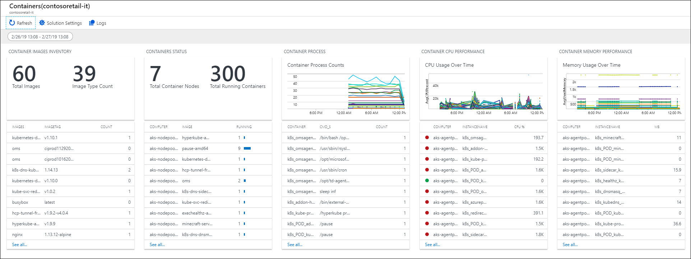

# Monitoring in Azure Kubernetes Services

The built-in logging in Kubernetes is primitive. However, there are some great options for getting the logs out of Kubernetes and into a place where they can be properly analyzed. If you need to monitor your AKS clusters, configuring Elastic Stack for Kubernetes is a great solution.

## Azure Monitor for Containers

[Azure Monitor for Containers](https://docs.microsoft.com/azure/azure-monitor/insights/container-insights-overview) supports consuming logs from not just Kubernetes but also from other orchestration engines such as DC/OS, Docker Swarm, and Red Hat OpenShift.

**Figure 7-10**. Consuming logs from various containers

[Prometheus](https://prometheus.io/) is a popular open source metric monitoring solution. It is part of the Cloud Native Compute Foundation. Typically, using Prometheus requires managing a Prometheus server with its own store. However, [Azure Monitor for Containers provides direct integration with Prometheus metrics endpoints](https://docs.microsoft.com/azure/azure-monitor/insights/container-insights-prometheus-integration), so a separate server is not required.

Log and metric information is gathered not just from the containers running in the cluster but also from the cluster hosts themselves. It allows correlating log information from the two making it much easier to track down an error.

Installing the log collectors differs on [Windows](https://docs.microsoft.com/azure/azure-monitor/insights/containers#configure-a-log-analytics-windows-agent-for-kubernetes) and [Linux](https://docs.microsoft.com/azure/azure-monitor/insights/containers#configure-a-log-analytics-linux-agent-for-kubernetes) clusters. But in both cases the log collection is implemented as a Kubernetes [DaemonSet](https://kubernetes.io/docs/concepts/workloads/controllers/daemonset/), meaning that the log collector is run as a container on each of the nodes.

No matter which orchestrator or operating system is running the Azure Monitor daemon, the log information is forwarded to the same Azure Monitor tools with which users are familiar. This ensures a parallel experience in environments that mix different log sources such as a hybrid Kubernetes/Azure Functions environment.

**Figure 7-11**. A sample dashboard showing logging and metric information from a number of running containers.

## Log.Finalize()

Logging is one of the most overlooked and yet most important parts of deploying any application at scale. As the size and complexity of applications increase, then so does the difficulty of debugging them. Having top quality logs available makes debugging much easier and moves it from the realm of "nearly impossible" to "a pleasant experience".

>[!div class="step-by-step"]
>[Previous](logging-with-elastic-stack.md)
>[Next](azure-monitor.md)
