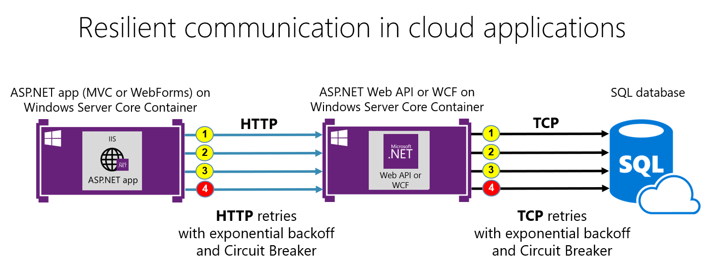

# Build resilient services ready for the cloud: Embrace transient failures in the cloud

Resiliency is the ability to recover from failures and continue to function. Resiliency is not about avoiding failures, but accepting the fact that failures will occur, and then responding to them in a way that avoids downtime or data loss. The goal of resiliency is to return the application to a fully functioning state after a failure.

Your application is ready for the cloud when, at a minimum, it implements a software-based model of resiliency, rather than a hardware-based model. Your cloud application must embrace the partial failures that will certainly occur. Design or partially refactor your application to achieve resiliency with expected partial failures. It should be designed to cope with partial failures, like transient network outages and nodes, or VMs crashing in the cloud. Even containers being moved to a different node within an orchestrator cluster can cause intermittent short failures within the application.

## Handling partial failure

In a cloud-based application, there's an ever-present risk of partial failure. For instance, a single website instance or a container might fail, or it might be unavailable or unresponsive for a short time. Or, a single VM or server might crash.

Because clients and services are separate processes, a service might not be able to respond in a timely manner to a client's request. The service might be overloaded and respond slowly to requests, or it might not be accessible for a short time because of network issues.

For example, consider a monolithic .NET application that accesses a database in Azure SQL Database. If the Azure SQL database or any other third-party service is unresponsive for a brief time (an Azure SQL database might be moved to a different node or server, and be unresponsive for a few seconds), when the user tries to do any action, the application might crash and show an exception at the same moment.

A similar scenario might occur in an app that consumes HTTP services. The network or the service itself might not be available in the cloud during a short, transient failure.

A resilient application like the one shown in Figure 4-9 should implement techniques like "retries with exponential backoff" to give the application an opportunity to handle transient failures in resources. You also should use "circuit breakers" in your applications. A circuit breaker stops an application from trying to access a resource when it's actually a long-term failure. By using a circuit breaker, the application avoids provoking a denial of service to itself.

**Figure 4-9.** Partial failures handled by retries with exponential backoff

You can use these techniques both in HTTP resources and in database resources. In Figure 4-9, the application is based on a 3-tier architecture, so you need these techniques at the services level (HTTP) and at the data tier level (TCP). In a monolithic application that uses only a single app tier in addition to the database (no additional services or microservices), handling transient failures at the database connection level might be enough. In that scenario, just a particular configuration of the database connection is required.

When implementing resilient communications that access the database, depending on the version of .NET you are using, it can be straightforward (for example, [with Entity Framework 6 or later](/ef/ef6/fundamentals/connection-resiliency/retry-logic). It's just a matter of configuring the database connection). Or, you might need to use additional libraries like the [Transient Fault Handling Application Block](https://docs.microsoft.com/previous-versions/msp-n-p/hh680934(v=pandp.50)) (for earlier versions of .NET), or even implement your own library.

When implementing HTTP retries and circuit breakers, the recommendation for .NET is to use the [Polly](https://github.com/App-vNext/Polly) library, which targets .NET Framework 4.0, .NET Framework 4.5, and .NET Standard 1.1, which includes .NET Core support.

To learn how to implement strategies for handling partial failures in the cloud, see the following references.

### Additional resources

- **Implementing resilient communication to handle partial failure**

    [https://docs.microsoft.com/dotnet/architecture/microservices/implement-resilient-applications/partial-failure-strategies](../../microservices/implement-resilient-applications/partial-failure-strategies.md)

- **Entity Framework connection resiliency and retry logic (version 6 and later)**

    [https://docs.microsoft.com/ef/ef6/fundamentals/connection-resiliency/retry-logic](/ef/ef6/fundamentals/connection-resiliency/retry-logic)

- **The Transient Fault Handling Application Block**

- <https://docs.microsoft.com/previous-versions/msp-n-p/hh680934(v=pandp.50)>

- **Polly library for resilient HTTP communication**

    <https://github.com/App-vNext/Polly>

>[!div class="step-by-step"]
>[Previous](when-to-deploy-windows-containers-to-azure-container-service-kubernetes.md)
>[Next](modernize-your-apps-with-monitoring-and-telemetry.md)
