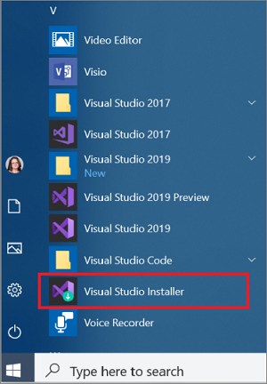
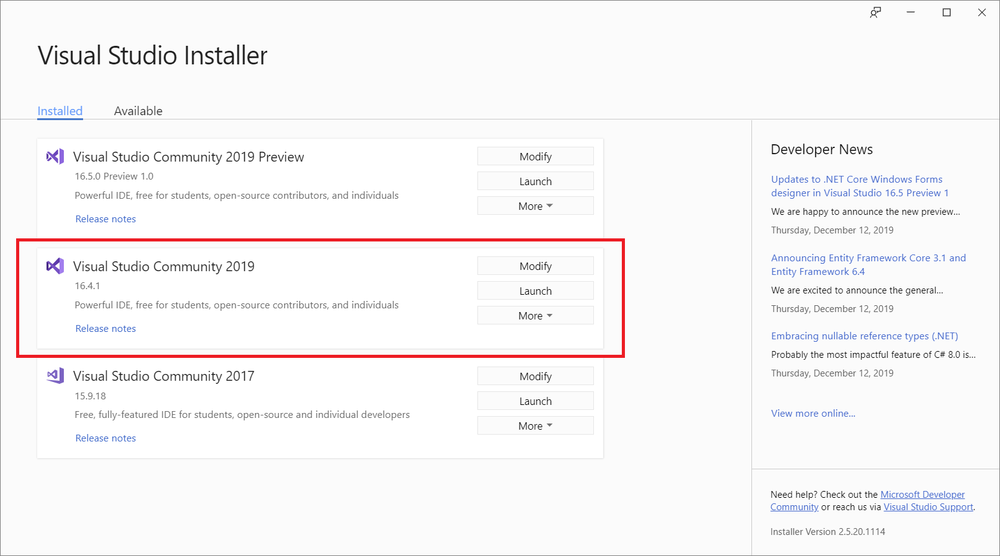
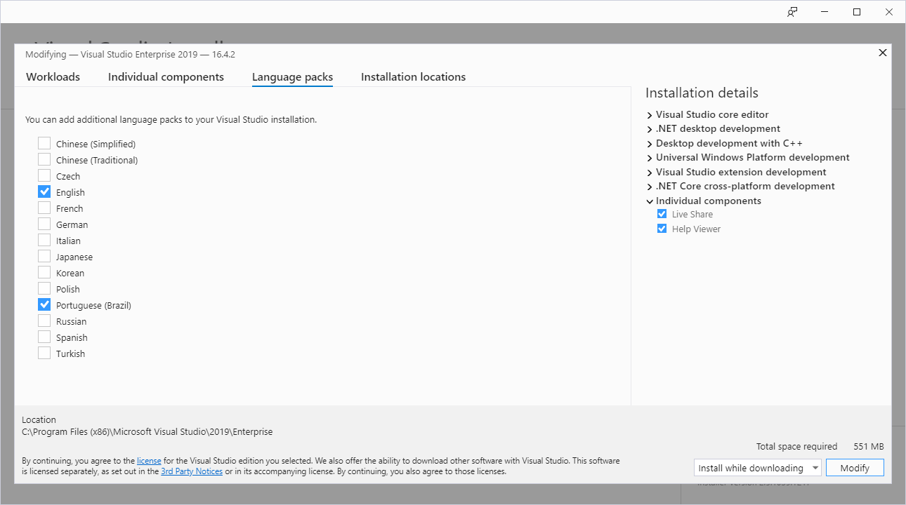

# How to install localized IntelliSense files for .NET Core

[IntelliSense](/visualstudio/ide/using-intellisense) is a code-completion aid that is available in different integrated development environments (IDEs), such as Visual Studio. By default, when you're developing .NET Core projects, the SDK only includes the English version of the IntelliSense files. This article explains:

- How to install the localized version of those files.
- How to modify the Visual Studio installation to use a different language.

## Prerequisites

- [.NET Core 3.0 SDK](https://dotnet.microsoft.com/download/dotnet-core) or a later version.
- [Visual Studio 2019 version 16.3](https://visualstudio.microsoft.com/downloads/?utm_medium=microsoft&utm_source=docs.microsoft.com&utm_campaign=inline+link&utm_content=download+vs2019) or a later version.

## Download and install the localized IntelliSense files

> [!IMPORTANT]
> This procedure requires that you have administrator permission to copy the IntelliSense files to the .NET Core installation folder.

1. Go to the [Download IntelliSense files](https://dotnet.microsoft.com/download/dotnet-core/intellisense) page.

1. Download the IntelliSense file for the language and version you'd like to use.

1. Extract the contents of the zip file.

1. Navigate to the .NET Core Intellisense folder.

   1. Navigate to the .NET Core installation folder. By default, it's under *%ProgramFiles%\dotnet\packs*.
   1. Choose which SDK you want to install the IntelliSense for, and navigate to the associated path. You have the following options:

      | SDK type        | Path                               |
      | --------------- | ---------------------------------- |
      | .NET Core       | *Microsoft.NETCore.App.Ref*        |
      | Windows Desktop | *Microsoft.WindowsDesktop.App.Ref* |
      | .NET Standard   | *NETStandard.Library.Ref*          |

   1. Navigate to the version you want to install the localized IntelliSense for. For example, *3.1.0*.
   1. Open the *ref* folder.
   1. Open the moniker folder. For example, *netcoreapp3.1*.

   So, the full path that you'd navigate to would look similar to *C:\Program Files\dotnet\packs\Microsoft.NETCore.App.Ref\3.1.0\ref\netcoreapp3.1*.

1. Create a subfolder inside the moniker folder you just opened. The name of the folder indicates which language you want to use. The following table specifies the different options:

   | Language              | Folder name |
   | --------------------- | ----------- |
   | Brazilian Portuguese  | *pt-br*     |
   | Chinese (simplified)  | *zh-hans*   |
   | Chinese (traditional) | *zh-hant*   |
   | French                | *fr*        |
   | German                | *de*        |
   | Italian               | *it*        |
   | Japanese              | *ja*        |
   | Korean                | *ko*        |
   | Russian               | *ru*        |
   | Spanish               | *es*        |

1. Copy the *.xml* files you extracted on step 3 to this new folder. The *.xml* files are broken down by SDK folders, so copy them to the matching SDK you chose on step 4.

## Modify Visual Studio language

For Visual Studio to use a different language for IntelliSense, install the appropriate language pack. This can be done [during installation](/visualstudio/install/install-visual-studio#step-6---install-language-packs-optional) or at a later time by modifying the Visual Studio installation. If you already have Visual Studio configured to the language of your choice, your IntelliSense installation is ready.

### Install the language pack

If you didn't install the desired language pack during setup, update Visual Studio as follows to install the language pack:

> [!IMPORTANT]
> To install, update, or modify Visual Studio, you must log on with an account that has administrator permission. For more information, see [User permissions and Visual Studio](/visualstudio/ide/user-permissions-and-visual-studio).

1. Find the Visual Studio Installer on your computer.

   For example, on a computer running Windows 10, select **Start**, and then scroll to the letter **V**, where it's listed as **Visual Studio Installer**.

   

   > [!NOTE]
   > You can also find the Visual Studio Installer in the following location:
   >
   > `C:\Program Files (x86)\Microsoft Visual Studio\Installer\vs_installer.exe`

   You might have to update the installer before continuing. If so, follow the prompts.

1. In the installer, look for the edition of Visual Studio that you want to add the language pack to, and then choose **Modify**.

   

   > [!IMPORTANT]
   > If you don't see a **Modify** button but you see an **Update** one instead, you need to update your Visual Studio before you can modify your installation.
   > After the update is finished, the **Modify** button should appear.

1. In the **Language packs** tab, select or deselect the languages you want to install or uninstall.

   

1. Choose **Modify**. The update starts.

### Modify language settings in Visual Studio

Once you've installed the desired language packs, modify your Visual Studio settings to use a different language:

1. Open Visual Studio.

1. On the start window, choose **Continue without code**.

1. On the menu bar, select **Tools** > **Options**. The Options dialog opens.

1. Under the **Environment** node, choose **International Settings**.

1. On the **Language** drop-down, select the desired language. Choose **OK**.

1. A dialog informs you that you have to restart Visual Studio for the changes to take effect. Choose **OK**.

1. Restart Visual Studio.

After this, your IntelliSense should work as expected when you open a .NET Core project that targets the version of the IntelliSense files you just installed.

## See also

- [IntelliSense in Visual Studio](/visualstudio/ide/using-intellisense)
