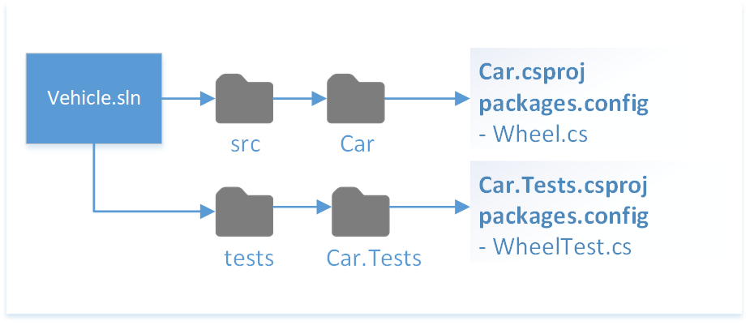
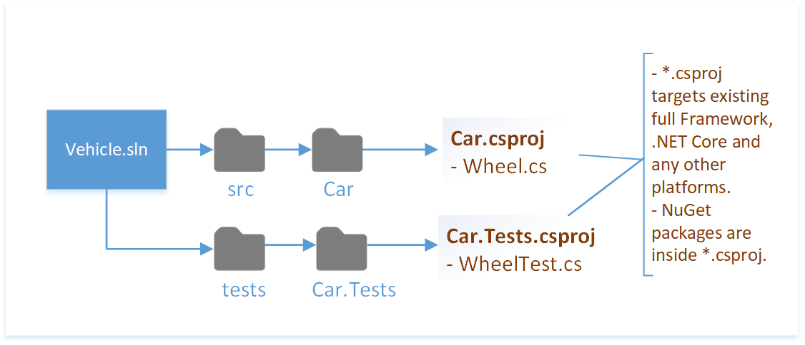
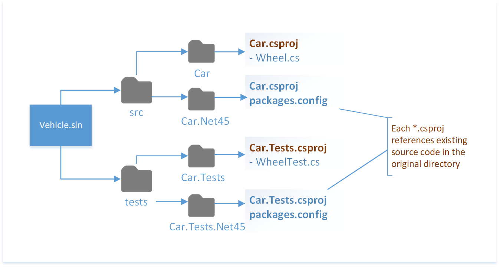

# Organize your project to support both .NET Framework and .NET Core

You can create a solution that compiles for both .NET Framework and .NET Core side-by-side. This article covers several project-organization options to help you achieve this goal. Here are some typical scenarios to consider when you're deciding how to set up your project layout with .NET Core. The list may not cover everything you want; prioritize based on your project's needs.

- [**Combine existing projects and .NET Core projects into single projects**](#replace-existing-projects-with-a-multi-targeted-net-core-project)

  *What this is good for:*
  - Simplifies your build process by compiling a single project rather than multiple projects that each target a different .NET Framework version or platform.
  - Simplifies source file management for multi-targeted projects because you must manage a single project file. When adding or removing source files, the alternatives require you to manually sync these with your other projects.
  - Easily generate a NuGet package for consumption.
  - Allows you to write code for a specific .NET Framework version in your libraries through the use of compiler directives.

  *Unsupported scenarios:*
  - Requires developers to use Visual Studio 2017 or a later version to open existing projects. To support older versions of Visual Studio, [keeping your project files in different folders](#support-vs) is a better option.

- [**Keep existing projects and new .NET Core projects separate**](#keep-existing-projects-and-create-a-net-core-project)

  *What this is good for:*
  - Supports development on existing projects for developers and contributors who may not have Visual Studio 2017 or a later version.
  - Decreases the possibility of creating new bugs in existing projects because no code churn is required in those projects.

## Example

Consider the repository below:

[**Source Code**](https://github.com/dotnet/samples/tree/master/framework/libraries/migrate-library/)

The following describes several ways to add support for .NET Core for this repository depending on the constraints and complexity of the existing projects.

## Replace existing projects with a multi-targeted .NET Core project

Reorganize the repository so that any existing *\*.csproj* files are removed and a single *\*.csproj* file is created that targets multiple frameworks. This is a great option, because a single project is able to compile for different frameworks. It also has the power to handle different compilation options and dependencies per targeted framework.

[**Source Code**](https://github.com/dotnet/samples/tree/master/framework/libraries/migrate-library-csproj/)

Changes to note are:

- Replacement of *packages.config* and *\*.csproj* with a new [.NET Core *\*.csproj*](https://github.com/dotnet/samples/tree/master/framework/libraries/migrate-library-csproj/src/Car/Car.csproj). NuGet packages are specified with `<PackageReference> ItemGroup`.

## Keep existing projects and create a .NET Core project

If there are existing projects that target older frameworks, you may want to leave these projects untouched and use a .NET Core project to target future frameworks.

[**Source Code**](https://github.com/dotnet/samples/tree/master/framework/libraries/migrate-library-csproj-keep-existing/)

The .NET Core and existing projects are kept in separate folders. Keeping projects in separate folders avoids forcing you to have Visual Studio 2017 or later versions. You can create a separate solution that only opens the old projects.

## See also

- [.NET Core porting documentation](index.md)
