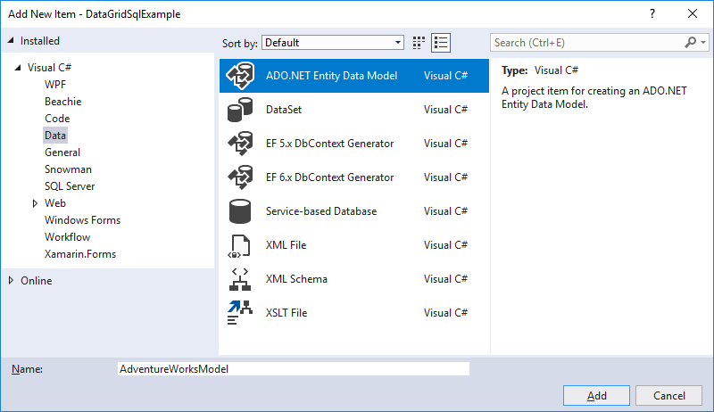

# Walkthrough: Display data from a SQL Server database in a DataGrid control

In this walkthrough, you retrieve data from a SQL Server database and display that data in a <xref:System.Windows.Controls.DataGrid> control. You use the ADO.NET Entity Framework to create the entity classes that represent the data, and use LINQ to write a query that retrieves the specified data from an entity class.

## Prerequisites

You need the following components to complete this walkthrough:

-   Visual Studio.

-   Access to a running instance of SQL Server or SQL Server Express that has the AdventureWorks sample database attached to it. You can download the AdventureWorks database from the [GitHub](https://github.com/Microsoft/sql-server-samples/releases).

## Create entity classes

1.  Create a new WPF Application project in Visual Basic or C#, and name it `DataGridSQLExample`.

2.  In Solution Explorer, right-click your project, point to **Add**, and then select **New Item**.

     The Add New Item dialog box appears.

3.  In the Installed Templates pane, select **Data** and in the list of templates, select **ADO.NET Entity Data Model**.

     

4.  Name the file `AdventureWorksModel.edmx` and then click **Add**.

     The Entity Data Model Wizard appears.

5.  In the Choose Model Contents screen, select **EF Designer from database** and then click **Next**.

6.  In the Choose Your Data Connection screen, provide the connection to your AdventureWorksLT2008 database. For more information, see [Choose Your Data Connection Dialog Box](https://go.microsoft.com/fwlink/?LinkId=160190).

    Make sure that the name is `AdventureWorksLT2008Entities` and that the **Save entity connection settings in App.Config as** check box is selected, and then click **Next**.

7.  In the Choose Your Database Objects screen, expand the Tables node, and select the **Product** and **ProductCategory** tables.

     You can generate entity classes for all of the tables; however, in this example you only retrieve data from those two tables.

     

8. Click **Finish**.

     The Product and ProductCategory entities are displayed in the Entity Designer.

     

## Retrieve and present the data

1.  Open the MainWindow.xaml file.

2.  Set the <xref:System.Windows.FrameworkElement.Width%2A> property on the <xref:System.Windows.Window> to 450.

3.  In the XAML editor, add the following <xref:System.Windows.Controls.DataGrid> tag between the `<Grid>` and `</Grid>` tags to add a <xref:System.Windows.Controls.DataGrid> named `dataGrid1`.

     [!code-xaml[DataGrid_SQL_EF_Walkthrough#3](../../../../samples/snippets/csharp/VS_Snippets_Wpf/DataGrid_SQL_EF_Walkthrough/CS/MainWindow.xaml#3)]

     

4.  Select the <xref:System.Windows.Window>.

5.  Using the Properties window or XAML editor, create an event handler for the <xref:System.Windows.Window> named `Window_Loaded` for the <xref:System.Windows.FrameworkElement.Loaded> event. For more information, see [How to: Create a Simple Event Handler](https://msdn.microsoft.com/library/b1456e07-9dec-4354-99cf-18666b64f480).

     The following shows the XAML for MainWindow.xaml.

    > [!NOTE]
    > If you are using Visual Basic, in the first line of MainWindow.xaml, replace `x:Class="DataGridSQLExample.MainWindow"` with `x:Class="MainWindow"`.

     [!code-xaml[DataGrid_SQL_EF_Walkthrough#1](../../../../samples/snippets/csharp/VS_Snippets_Wpf/DataGrid_SQL_EF_Walkthrough/CS/MainWindow.xaml#1)]

6.  Open the code-behind file (MainWindow.xaml.vb or MainWindow.xaml.cs) for the <xref:System.Windows.Window>.

7.  Add the following code to retrieve only specific values from the joined tables and set the <xref:System.Windows.Controls.ItemsControl.ItemsSource%2A> property of the <xref:System.Windows.Controls.DataGrid> to the results of the query.

     [!code-csharp[DataGrid_SQL_EF_Walkthrough#2](../../../../samples/snippets/csharp/VS_Snippets_Wpf/DataGrid_SQL_EF_Walkthrough/CS/MainWindow.xaml.cs#2)]
     [!code-vb[DataGrid_SQL_EF_Walkthrough#2](../../../../samples/snippets/visualbasic/VS_Snippets_Wpf/DataGrid_SQL_EF_Walkthrough/VB/MainWindow.xaml.vb#2)]

8.  Run the example.

     You should see a <xref:System.Windows.Controls.DataGrid> that displays data.

     

## See also

- <xref:System.Windows.Controls.DataGrid>
- [How Do I: Get Started with Entity Framework in WPF Applications?](https://go.microsoft.com/fwlink/?LinkId=159868)